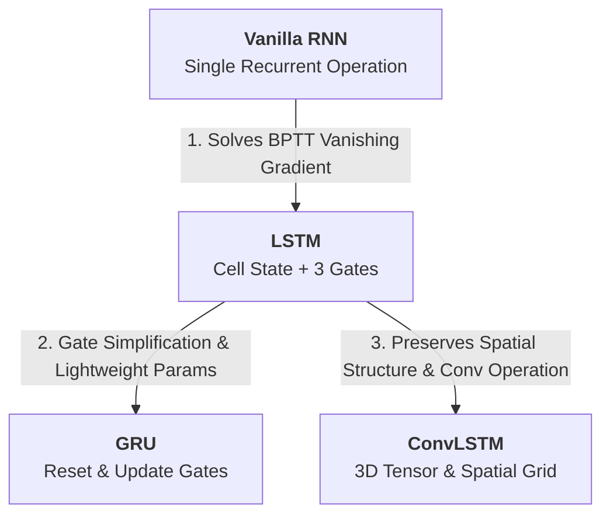

> <b>Summary</b>: This post analyzes the evolution of recurrent architectures for sequence processing, starting from the BPTT vanishing gradient limits of <b>Vanilla RNN</b>, to the Cell State control mechanism of <b>LSTM</b>, the lightweight gate simplification of <b>GRU</b>, and finally <b>ConvLSTM</b>, which integrates 3D tensors and convolution operations to enable spatiotemporal sequence modeling.

---

## 1. Lineage of Recurrent Neural Network Architectures

The architectural progression from processing 1D temporal dependencies in sequence data to preserving spatial structures in image/video data follows this trajectory:

---

## 2. Vanilla RNN: Recurrent Operations and BPTT Limitations

### 2.1 Architecture and Recurrent Operations
Vanilla RNN is the simplest recurrent structure that updates the current hidden state $h_t$ by combining the previous hidden state $h_{t-1}$ and the current input $x_t$.

*Figure 1: Information flow and recurrent structure comparison between Feedforward NN and Recurrent NN*

- Hidden State Calculation: $h_t = \tanh(W_{hh} h_{t-1} + W_{xh} x_t + b_h)$
- Output Calculation: $O_t = \sigma(W_{ho} h_t + b_o)$

### 2.2 BPTT (Backpropagation Through Time) and Vanishing Gradient
During backpropagation across unrolled time steps, the gradient propagated back to a past time step $k$ involves the consecutive multiplication of the weight matrix $W_{hh}^T$:

$$\frac{\partial \mathcal{L}}{\partial W_{hh}} \propto \sum_{k=1}^{t} (W_{hh}^T)^{t-k} h_k$$

As sequence length $(t - k)$ increases, if the eigenvalues of $W_{hh}$ are less than 1, the gradient exponentially decays to 0 (<b>Vanishing Gradient</b>), rendering the network incapable of learning long-term dependencies.

---

## 3. LSTM (Long Short-Term Memory): Cell State-Based Information Control

### 3.1 Architectural Structure
LSTM introduces a <b>Cell State ($C_t$)</b> that acts as a highway for uninterrupted information flow, governed by three gating mechanisms (Forget, Input, Output Gates).

*Figure 2: Internal cell architecture and three gating structures of LSTM*

### 3.2 Gate-by-Gate Operations
1. <b>Forget Gate ($f_t$)</b>: Decides the proportion (0 to 1) of information to retain from the previous Cell State $C_{t-1}$.
   $$f_t = \sigma(W_f \cdot [h_{t-1}, x_t] + b_f)$$
2. <b>Input Gate ($i_t$)</b>: Controls how much new information from current input $x_t$ should be stored in the Cell State.
   $$i_t = \sigma(W_i \cdot [h_{t-1}, x_t] + b_i)$$
   $$\tilde{C}_t = \tanh(W_c \cdot [h_{t-1}, x_t] + b_c)$$ *(New candidate cell state)*
3. <b>Cell State Update ($C_t$)</b>: Scales the previous cell state by the forget gate and adds the gated new candidate state.
   $$C_t = f_t \circ C_{t-1} + i_t \circ \tilde{C}_t$$
4. <b>Output Gate ($o_t$ & $h_t$)</b>: Computes the external hidden state $h_t$ based on the updated Cell State.
   $$o_t = \sigma(W_o \cdot [h_{t-1}, x_t] + b_o)$$
   $$h_t = o_t \circ \tanh(C_t)$$

---

## 4. GRU (Gated Recurrent Unit): Hidden State Integration and Gate Simplification

### 4.1 Architectural Structure
GRU simplifies the LSTM architecture by merging the Cell State and Hidden State into a single state ($h_t$) and reducing the gates to two (Reset Gate, Update Gate).

*Figure 3: Internal cell architecture of GRU (Reset and Update Gates)*

### 4.2 Gate-by-Gate Operations
1. <b>Reset Gate ($r_t$)</b>: Determines how much of the previous hidden state $h_{t-1}$ to forget when computing the new candidate state.
   $$r_t = \sigma(W_r \cdot [h_{t-1}, x_t] + b_r)$$
2. <b>Update Gate ($z_t$)</b>: Controls the interpolation ratio between the previous state $h_{t-1}$ and the candidate state $\tilde{h}_t$.
   $$z_t = \sigma(W_z \cdot [h_{t-1}, x_t] + b_z)$$
3. <b>Candidate Hidden State ($\tilde{h}_t$)</b>:
   $$\tilde{h}_t = \tanh(W \cdot [r_t \circ h_{t-1}, x_t] + b)$$
4. <b>Hidden State Update ($h_t$)</b>:
   $$h_t = (1 - z_t) \circ h_{t-1} + z_t \circ \tilde{h}_t$$

---

## 5. Limitations of LSTM and GRU: Loss of Spatial Structure

LSTM and GRU operate on 1D vectors. Flattening 2D/3D image sequences (e.g., Height $\times$ Width) into 1D vectors introduces significant engineering drawbacks:

1. <b>Destruction of Spatial Locality</b>: Pixel adjacency relations across rows and columns are completely lost.
2. <b>Parameter Inefficiency</b>: All pixel nodes are fully connected, causing weight parameters and computation to scale redundantly with input dimensions.

---

## 6. ConvLSTM (Convolutional LSTM): Integrated Spatiotemporal Architecture

### 6.1 3D Tensor Input/Output Structure
ConvLSTM replaces matrix multiplication with <b>Convolution operations ($*$)</b>, maintaining inputs, cell states, hidden states, and all gates as <b>3D Tensors (Channels $\times$ Height $\times$ Width)</b>.

*Figure 4: Transformation of 2D input sequence into a spatial grid-preserving 3D tensor*

### 6.2 ConvLSTM Internal Gate Operations
ConvLSTM applies convolution kernels in both input-to-state and state-to-state transitions.

*Figure 5: Internal gate operation architecture of ConvLSTM*

- <b>Input Gate</b>: $$i_t = \sigma(W_{xi} * \mathcal{X}_t + W_{hi} * \mathcal{H}_{t-1} + W_{ci} \circ \mathcal{C}_{t-1} + b_i)$$
- <b>Forget Gate</b>: $$f_t = \sigma(W_{xf} * \mathcal{X}_t + W_{hf} * \mathcal{H}_{t-1} + W_{cf} \circ \mathcal{C}_{t-1} + b_f)$$
- <b>Cell State Update</b>: $$\mathcal{C}_t = f_t \circ \mathcal{C}_{t-1} + i_t \circ \tanh(W_{xc} * \mathcal{X}_t + W_{hc} * \mathcal{H}_{t-1} + b_c)$$
- <b>Output Gate</b>: $$o_t = \sigma(W_{xo} * \mathcal{X}_t + W_{ho} * \mathcal{H}_{t-1} + W_{co} \circ \mathcal{C}_t + b_o)$$
- <b>Hidden State Update</b>: $$\mathcal{H}_t = o_t \circ \tanh(\mathcal{C}_t)$$

> <b>Impact of Convolution Kernel Size</b>:
> In ConvLSTM, larger kernel sizes cover a broader receptive field to capture fast motions across spatial grids, whereas smaller kernels excel at tracking fine-grained localized dynamics.

### 6.3 Encoding-Forecasting Architecture
For spatiotemporal sequence forecasting (e.g., precipitation nowcasting, video frame prediction), multiple ConvLSTM layers are stacked into an <b>Encoding-Forecasting</b> structure.

*Figure 6: Encoding-Forecasting ConvLSTM network architecture for precipitation nowcasting*

1. <b>Encoding Network</b>: Consumes past image sequences sequentially to compress and accumulate spatiotemporal features into 3D hidden/cell state tensors.
2. <b>Forecasting Network</b>: Takes the final states of the encoding network to unfold 3D tensor states and generate future image predictions.

---

## 7. Architectural Comparison Summary

| Architecture | Data Representation | Core Operation | Memory / Gate Structure | Spatiotemporal Modeling Mechanism |
| :--- | :--- | :--- | :--- | :--- |
| <b>Vanilla RNN</b> | 1D Vector | Fully-Connected | No Gate (Single Tanh) | Captures short-term temporal dynamics (BPTT limit) |
| <b>LSTM</b> | 1D Vector | Fully-Connected | Forget, Input, Output Gate / <b>Separate Cell State</b> | Controls long-term temporal dependencies (Loss of spatial structure) |
| <b>GRU</b> | 1D Vector | Fully-Connected | Reset, Update Gate / <b>Unified Hidden State</b> | Controls long-term temporal dependencies with lightweight parameters |
| <b>ConvLSTM</b> | 3D Tensor | Convolution ($*$) | Forget, Input, Output Gate / <b>3D Grid Preserved</b> | <b>Jointly models long-term temporal dependencies and spatial locality</b> |
