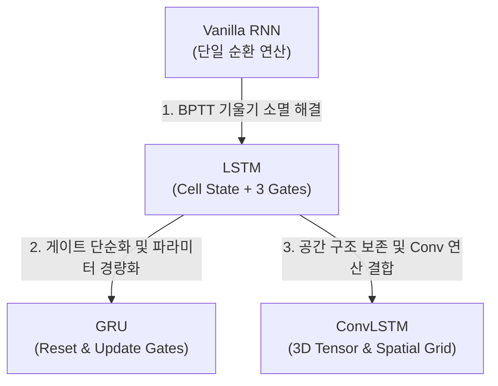

> <b>요약</b>: 순차적 데이터(Sequence Data) 처리를 위한 <b>Vanilla RNN</b>의 동작 연산과 BPTT 기울기 소멸 한계부터, 이를 해결하기 위한 <b>LSTM</b>의 Cell State 제어 메커니즘, 구조를 경량화한 <b>GRU</b>, 그리고 3D 텐서 기반 Convolution 연산을 결합하여 시공간(Spatiotemporal) 데이터 처리를 가능하게 한 <b>ConvLSTM</b>의 아키텍처를 순차적으로 분석합니다.

---

## 1. 순환 신경망 아키텍처의 발전 계보

순차적 데이터의 시간 의존성(Temporal Dependency) 처리부터 이미지/비디오 데이터의 공간 구조(Spatial Structure) 보존으로 이어지는 아키텍처 발전 흐름은 다음과 같습니다.

---

## 2. Vanilla RNN : 순환 연산 메커니즘과 BPTT의 한계

### 2.1 아키텍처 및 순환 연산
Vanilla RNN은 이전 시점의 은닉 상태(Hidden State) $h_{t-1}$과 현재 입력 $x_t$를 결합하여 현재 은닉 상태 $h_t$를 계산하는 가장 단순한 순환 구조입니다.

*Figure 1: Feedforward Neural Network와 Recurrent Neural Network의 정보 전달 및 순환 구조*

- 은닉 상태 계산: $h_t = \tanh(W_{hh} h_{t-1} + W_{xh} x_t + b_h)$
- 출력 계산: $O_t = \sigma(W_{ho} h_t + b_o)$

### 2.2 BPTT (Backpropagation Through Time)와 기울기 소멸
시간 축으로 전개된 network의 역전파 연산 시, 특정 과거 시점 $k$까지 전달되는 기울기는 가중치 행렬 $W_{hh}^T$의 연속적인 곱으로 표현됩니다.

$$\frac{\partial \mathcal{L}}{\partial W_{hh}} \propto \sum_{k=1}^{t} (W_{hh}^T)^{t-k} h_k$$

시퀀스 길이 $(t - k)$가 증가할 때 $W_{hh}$의 고윳값이 1보다 작으면 기울기가 0으로 지수적으로 수렴하는 <b>기울기 소멸(Vanishing Gradient)</b>이 발생하여 장기 의존성 학습이 불가능해집니다.

---

## 3. LSTM (Long Short-Term Memory) : 셀 상태 기반의 정보 제어 아키텍처

### 3.1 아키텍처 구조
LSTM은 정보의 지속적 전달을 전담하는 <b>셀 상태(Cell State, $C_t$)</b>를 도입하고, 3개의 게이트(Forget, Input, Output Gate)를 통해 정보의 추가 및 삭제를 제어합니다.

*Figure 2: LSTM 셀의 내부 아키텍처 및 3가지 게이트 구조*

### 3.2 게이트별 연산 메커니즘
1. <b>망각 게이트 (Forget Gate, $f_t$)</b>: 이전 셀 상태 $C_{t-1}$에서 보존할 정보의 비율(0~1)을 결정합니다.
   $$f_t = \sigma(W_f \cdot [h_{t-1}, x_t] + b_f)$$
2. <b>입력 게이트 (Input Gate, $i_t$)</b>: 현재 입력 $x_t$로부터 셀 상태에 새로 추가할 정보의 양을 제어합니다.
   $$i_t = \sigma(W_i \cdot [h_{t-1}, x_t] + b_i)$$
   $$\tilde{C}_t = \tanh(W_c \cdot [h_{t-1}, x_t] + b_c)$$ *(새로운 후보 셀 상태)*
3. <b>셀 상태 갱신 (Cell State Update, $C_t$)</b>: 이전 셀 상태를 망각 게이트로 스케일링하고 새로운 정보를 더합니다.
   $$C_t = f_t \circ C_{t-1} + i_t \circ \tilde{C}_t$$
4. <b>출력 게이트 (Output Gate, $o_t$ & $h_t$)</b>: 갱신된 셀 상태를 바탕으로 외부 출력 은닉 상태 $h_t$를 계산합니다.
   $$o_t = \sigma(W_o \cdot [h_{t-1}, x_t] + b_o)$$
   $$h_t = o_t \circ \tanh(C_t)$$

---

## 4. GRU (Gated Recurrent Unit) : 은닉 상태 통합 및 게이트 단순화

### 4.1 아키텍처 구조
GRU는 LSTM의 Cell State와 Hidden State를 하나($h_t$)로 통합하고, 게이트 구성을 2개(Reset Gate, Update Gate)로 줄여 아키텍처를 단순화했습니다.

*Figure 3: GRU 셀의 내부 아키텍처 (Reset Gate 및 Update Gate)*

### 4.2 게이트별 연산 메커니즘
1. <b>리셋 게이트 (Reset Gate, $r_t$)</b>: 이전 은닉 상태 $h_{t-1}$의 정보를 새로운 후보 상태 계산 시 얼마나 반영할지 결정합니다.
   $$r_t = \sigma(W_r \cdot [h_{t-1}, x_t] + b_r)$$
2. <b>업데이트 게이트 (Update Gate, $z_t$)</b>: 이전 은닉 상태 $h_{t-1}$와 새로운 후보 상태 $\tilde{h}_t$ 간의 보간 비율을 결정합니다. (LSTM의 Forget/Input Gate 역할 통합)
   $$z_t = \sigma(W_z \cdot [h_{t-1}, x_t] + b_z)$$
3. <b>후보 은닉 상태 (Candidate Hidden State, $\tilde{h}_t$)</b>:
   $$\tilde{h}_t = \tanh(W \cdot [r_t \circ h_{t-1}, x_t] + b)$$
4. <b>최종 은닉 상태 갱신 (Hidden State Update, $h_t$)</b>:
   $$h_t = (1 - z_t) \circ h_{t-1} + z_t \circ \tilde{h}_t$$

---

## 5. LSTM과 GRU의 한계 : 공간 구조(Spatial Structure) 정보 손실

LSTM과 GRU는 입출력 데이터를 1차원 벡터로 처리합니다. 2D/3D 이미지 시퀀스(예: Height $\times$ Width)를 1차원 벡터로 평탄화(Flatten)하는 과정에서 다음과 같은 공학적 한계가 발생합니다.

1. <b>공간 국소성(Spatial Locality) 파괴</b>: 행/열 기반 픽셀 인접 관계 정보가 손실됩니다.
2. <b>파라미터 비효율성</b>: 모든 픽셀 노드가 전 결합(Fully-Connected)되어 입력 차원에 비례하여 가중치 파라미터와 연산량이 비대해집니다.

---

## 6. ConvLSTM (Convolutional LSTM) : 공간-시간 통합 아키텍처

### 6.1 3D 텐서 기반 입출력 구조
ConvLSTM은 기존 LSTM의 행렬 곱셈 연산을 <b>Convolution 연산($*$)</b>으로 대체하여, 입력, 셀 상태, 은닉 상태 및 모든 게이트를 <b>3D 텐서 (Channels $\times$ Height $\times$ Width)</b> 형태로 유지합니다.

*Figure 4: 2D 입력 시퀀스를 공간 구조(Spatial Grid)가 보존되는 3D 텐서로 변환*

### 6.2 ConvLSTM 내부 게이트 연산 구조
ConvLSTM의 내부 게이트는 입력-상태 및 상태-상태 전이에서 모두 Convolution 커널을 적용합니다.

*Figure 5: ConvLSTM의 내부 게이트 연산 아키텍처*

- <b>입력 게이트</b>: $$i_t = \sigma(W_{xi} * \mathcal{X}_t + W_{hi} * \mathcal{H}_{t-1} + W_{ci} \circ \mathcal{C}_{t-1} + b_i)$$
- <b>망각 게이트</b>: $$f_t = \sigma(W_{xf} * \mathcal{X}_t + W_{hf} * \mathcal{H}_{t-1} + W_{cf} \circ \mathcal{C}_{t-1} + b_f)$$
- <b>셀 상태 갱신</b>: $$\mathcal{C}_t = f_t \circ \mathcal{C}_{t-1} + i_t \circ \tanh(W_{xc} * \mathcal{X}_t + W_{hc} * \mathcal{H}_{t-1} + b_c)$$
- <b>출력 게이트</b>: $$o_t = \sigma(W_{xo} * \mathcal{X}_t + W_{ho} * \mathcal{H}_{t-1} + W_{co} \circ \mathcal{C}_t + b_o)$$
- <b>은닉 상태 갱신</b>: $$\mathcal{H}_t = o_t \circ \tanh(\mathcal{C}_t)$$

> <b>Convolution 커널 크기의 영향</b>:
> ConvLSTM에서 필터 커널 크기(Kernel Size)가 클수록 더 넓은 수용 영역(Receptive Field)을 커버하여 빠른 시공간 움직임(Fast Motion)을 포착할 수 있으며, 작은 커널은 디테일한 미세 변화 추적에 유리합니다.

### 6.3 Encoding-Forecasting 아키텍처
시공간 시퀀스 예측(예: 초단기 강수 예측, 비디오 프레임 예측)을 위해 ConvLSTM 레이어를 다층으로 쌓아 <b>Encoding-Forecasting</b> 구조를 형성합니다.

*Figure 6: 강수 예측(Precipitation Nowcasting)을 위한 Encoding-Forecasting ConvLSTM 네트워크 아키텍처*

1. <b>Encoding Network</b>: 과거 연속 이미지 시퀀스를 차례로 입력받아 숨겨진 3D 상태 텐서(Hidden/Cell State)에 시공간 특성을 압축 축적합니다.
2. <b>Forecasting Network</b>: Encoding Network의 최종 은닉 상태를 전달받아 미래 N개 시점의 3D 텐서 상태를 펼치면서 연속된 미래 이미지를 생성 및 예측합니다.

---

## 7. 아키텍처별 공학적 비교 요약

| 아키텍처 | 입출력 데이터 형태 | 핵심 연산 | 메모리 / 게이트 구조 | 시공간 특성 반영 방식 |
| :--- | :--- | :--- | :--- | :--- |
| <b>Vanilla RNN</b> | 1D Vector | Fully-Connected | 게이트 없음 (단일 Tanh) | 시간 단기 의존성만 반영 (BPTT 한계) |
| <b>LSTM</b> | 1D Vector | Fully-Connected | Forget, Input, Output Gate / <b>Cell State 분리</b> | 시간 장기 의존성 제어 (공간 정보 파괴) |
| <b>GRU</b> | 1D Vector | Fully-Connected | Reset, Update Gate / <b>Hidden State 통합</b> | 시간 장기 의존성 제어 및 경량화 (공간 정보 파괴) |
| <b>ConvLSTM</b> | 3D Tensor | Convolution ($*$) | Forget, Input, Output Gate / <b>3D Grid 보존</b> | <b>시간 차원의 장기 의존성과 공간 차원의 국소성을 동시에 반영</b> |
